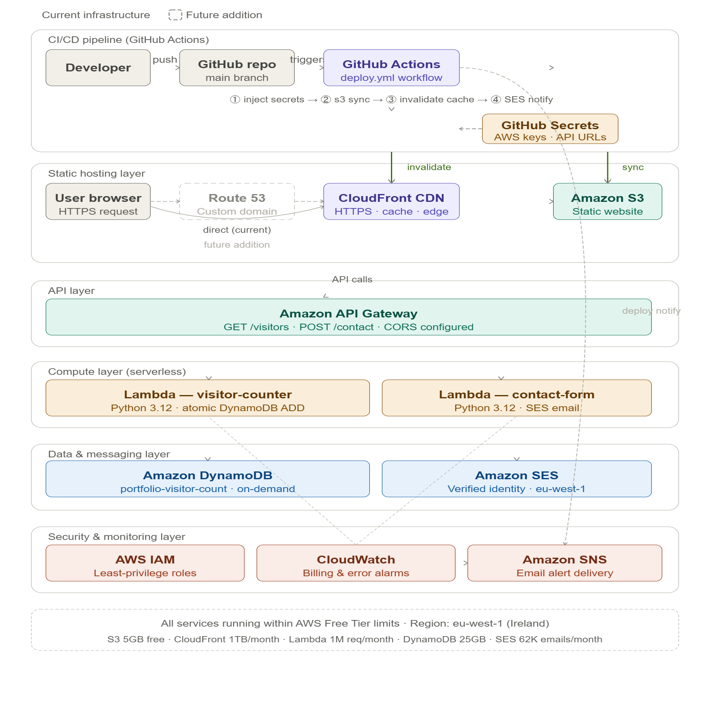

# AWS Serverless Portfolio Website



## 🌐 Live Site
[https://d2monq1h13acmt.cloudfront.net](https://d2monq1h13acmt.cloudfront.net)

---

## 📋 Project Overview

A personal portfolio and CV website built entirely on AWS using a fully serverless architecture. The site showcases professional experience, skills, and certifications, and includes a live visitor counter and a working contact form — all without a single server to manage.

This project was built as a hands-on AWS learning exercise to complement the AWS Certified Solutions Architect – Associate certification.

---

## 🏗️ Architecture

The architecture is split into two layers:

**Static hosting layer**
- Website files (HTML, CSS, JS) are stored in an **Amazon S3** bucket with static website hosting enabled
- **Amazon CloudFront** sits in front of S3 as a CDN, distributing content globally, enforcing HTTPS, and caching files at edge locations for low latency

**Serverless backend layer**
- **Amazon API Gateway** (HTTP API) exposes two endpoints: `GET /visitors` and `POST /contact`
- **AWS Lambda** (Python 3.12) handles the logic for both endpoints
- **Amazon DynamoDB** stores and atomically increments the visitor count
- **Amazon SES** sends contact form submissions directly to the inbox

---

## ☁️ AWS Services Used

| Service | Purpose |
|---|---|
| Amazon S3 | Static website file storage and hosting |
| Amazon CloudFront | CDN, HTTPS termination, global edge caching |
| Amazon API Gateway | HTTP API routing to Lambda functions |
| AWS Lambda | Serverless visitor counter and contact form logic |
| Amazon DynamoDB | Persistent visitor count storage (on-demand) |
| Amazon SES | Transactional email delivery for contact form |
| AWS IAM | Least-privilege execution roles for Lambda |

---

## ✅ Key Concepts Demonstrated

- S3 static website hosting with bucket policies
- CloudFront distribution with HTTPS redirect and cache invalidation
- Serverless API design with API Gateway HTTP API
- Lambda function development in Python
- Atomic DynamoDB item updates
- SES email delivery from a sandboxed identity
- CORS configuration for cross-origin API requests
- IAM role scoping for Lambda execution
- End-to-end testing and debugging with CloudWatch Logs

---

## 📁 Repository Structure

```
aws-portfolio-site/
├── README.md
├── architecture-diagram/
│   └── architecture.png
├── website/
│   ├── index.html
│   └── style.css
└── lambda/
    ├── visitor_counter.py
    └── contact_form.py
```

---

## ⚙️ Deployment Steps

### 1. S3 Bucket
- Create an S3 bucket with static website hosting enabled
- Set index document to `index.html`
- Apply a public read bucket policy
- Upload all files from the `website/` folder

### 2. CloudFront Distribution
- Create a distribution with the S3 website endpoint as the origin (not the REST endpoint)
- Set viewer protocol policy to Redirect HTTP to HTTPS
- Set default root object to `index.html`
- Note the CloudFront distribution domain name

### 3. DynamoDB Table
- Create a table named `portfolio-visitor-count`
- Partition key: `id` (String)
- Create an initial item: `id = visitors`, `count = 0`
- Billing mode: On-demand

### 4. Lambda Functions
- Create `visitor-counter` (Python 3.12) with DynamoDB read/write permissions
- Create `contact-form-handler` (Python 3.12) with SES send permissions
- Attach an IAM execution role with least-privilege policies

### 5. API Gateway
- Create an HTTP API named `portfolio-api`
- Add route: `GET /visitors` → `visitor-counter` Lambda
- Add route: `POST /contact` → `contact-form-handler` Lambda
- Configure CORS: Allow-Origin `*`, Allow-Headers `content-type`, Allow-Methods `GET POST OPTIONS`

### 6. SES
- Verify sender email identity in the same region as Lambda
- Confirm verification via the link sent to the inbox

### 7. Update and deploy
- Re-upload `index.html` to S3
- Invalidate the CloudFront cache: `/*`

---

## 💰 Cost

Built entirely within the AWS Free Tier:

| Service | Free Tier Limit |
|---|---|
| S3 | 5 GB storage, 20,000 GET requests/month |
| CloudFront | 1 TB data transfer, 10M requests/month |
| Lambda | 1M requests, 400,000 GB-seconds/month |
| API Gateway | 1M HTTP API calls/month |
| DynamoDB | 25 GB storage, 25 WCU/RCU (on-demand free tier) |
| SES | 62,000 outbound emails/month (when sent from Lambda) |

---

## 🧹 Cleanup

To avoid charges after the project:

1. Disable and delete the CloudFront distribution
2. Empty and delete the S3 bucket
3. Delete both Lambda functions
4. Delete the API Gateway
5. Delete the DynamoDB table
6. Remove the SES verified identity

---

## 📌 Lessons Learned

- CloudFront origin must use the S3 **website endpoint** (with `-website` in the URL), not the REST endpoint — otherwise folder paths return Access Denied
- SES and Lambda must be in the **same AWS region** for email delivery to work
- CORS must be configured on API Gateway and headers must also be returned in Lambda responses
- Auto-deploy on API Gateway stages means CORS changes take effect immediately without manual deployment

---

## 👩‍💻 Author

**Charity W. Maina**  
AWS Certified Solutions Architect – Associate | IT Engineer  
[LinkedIn](https://www.linkedin.com/in/charity-w-maina) · [Live Site](https://d2monq1h13acmt.cloudfront.net)
